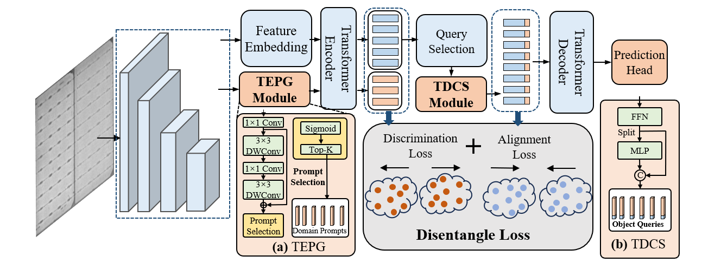

# FDDA: A Feature Disentangling Domain Adaptation Method for Robust Industrial Defect Detection

By Zhaoyang Wang, Haiyong Chen, Binyi Su, Shijie Wang, and Amal Altaezi.

This repository contains the implementation accompanying our paper FDDA: A Feature Disentangling Domain Adaptation Method for Robust Industrial Defect Detection.

If you find it helpful for your research, please consider citing:

```
@ARTICLE{fdda,
  author={Zhaoyang Wang, Haiyong Chen, Binyi Su, Shijie Wang, and Amal Altaezi},
  journal={IEEE Transactions on Automation Science and Engineering}, 
  title={FDDA: A Feature Disentangling Domain Adaptation Method for Robust Industrial Defect Detection}, 
  year={-},
  volume={-},
  pages={-}}
```



## Acknowledgment

Our FDDA implementation is bulit upon [detrex](https://github.com/IDEA-Research/detrex).

## Installation

Please refer to [Installation Instructions](https://detrex.readthedocs.io/en/latest/tutorials/Installation.html) for the details of installation.

## Getting Started

Please refer to [Getting Started with detrex](https://detrex.readthedocs.io/en/latest/tutorials/Getting_Started.html) for the basic usage of detrex. We also provides other tutorials for:
- [Learn about the config system of detrex](https://detrex.readthedocs.io/en/latest/tutorials/Config_System.html)
- [How to convert the pretrained weights from original detr repo into detrex format](https://detrex.readthedocs.io/en/latest/tutorials/Converters.html)
- [Visualize your training data and testing results on COCO dataset](https://detrex.readthedocs.io/en/latest/tutorials/Tools.html#visualization)
- [Analyze the model under detrex](https://detrex.readthedocs.io/en/latest/tutorials/Tools.html#model-analysis)
- [Download and initialize with the pretrained backbone weights](https://detrex.readthedocs.io/en/latest/tutorials/Using_Pretrained_Backbone.html)
- [Frequently asked questions](https://github.com/IDEA-Research/detrex/issues/109)
- [A simple onnx convert tutorial provided by powermano](https://github.com/IDEA-Research/detrex/issues/192)
- Simple training techniques: [Model-EMA](https://github.com/IDEA-Research/detrex/pull/201), [Mixed Precision Training](https://github.com/IDEA-Research/detrex/pull/198), [Activation Checkpoint](https://github.com/IDEA-Research/detrex/pull/200)
- [Simple tutorial about custom dataset training](https://github.com/IDEA-Research/detrex/pull/187)

Although some of the tutorials are currently presented with relatively simple content, we will constantly improve our documentation to help users achieve a better user experience.

## Documentation

Please see [documentation](https://detrex.readthedocs.io/en/latest/index.html) for full API documentation and tutorials.

## About FDDA
### How to use 

- First, make sure you have installed the detrex project properly, which can be used for training and inference.
- Download the ELES, TTD and MHHS datasets and convert the annotation files into COCO-format annotations.


  (1) For the Feature Disentangled Pre-traning (FDP):

  ```
  python tools/fdp.py --config-file projects/fdda/configs/models/dino_fdda.py train.output_dir outputs/fdda_fdp
  ```

 (2) For the Domain Prompt Adaptation (DPA):
  ```
  python tools/dpa.py --config-file projects/fdda/configs/models/dino_fdda.py train.init_checkpoint outputs/fdda_fdp/model_final.pth
  ```
 (3) For the Domain Prompt Adaptation (DPA):
  ```
  python tools/dpa.py --config-file projects/fdda/configs/fdda_dino_dpa_12ep.py --eval-only
  ```

### The FDDA content


  (1) TEPG Module:

  ```
  detrex/modeling/backbones/tepg.py
  ```

 (2) TDCS Module:
  ```
  detrex/modeling/backbones/tdcs.py
  ```
 (3) FDDA Detector:
  ```
  projects/fdda/modeling/fdda.py
  ```
 (4) Loss Function:
  ```
  detrex/modeling/criterion/fdda_criterion.py
  ```

## License

This project is released under the [Apache 2.0 license](LICENSE).


## Acknowledgement
- detrex is an open-source toolbox for Transformer-based detection algorithms created by researchers of **IDEACVR**. We appreciate all contributions to detrex!
- detrex is built based on [Detectron2](https://github.com/facebookresearch/detectron2) and part of its module design is borrowed from [MMDetection](https://github.com/open-mmlab/mmdetection), [DETR](https://github.com/facebookresearch/detr), and [Deformable-DETR](https://github.com/fundamentalvision/Deformable-DETR).

